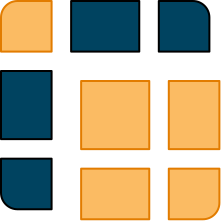

# Pixeli (Pre-release) [](https://www.npmjs.com/package/pixeli)



**Pixeli** is a lightweight and flexible command-line tool for merging multiple images into clean, customizable grid layouts. It’s designed for speed and simplicity, making it ideal for generating collages, previews, gallery layouts, inspiration boards, and composite images without relying on heavy desktop software.

Pixeli uses Sharp, a Node.js wrapper for the libvips library which is based on C. This makes it an extremely fast tool with support for PNG, JPG, GIF, SVG, AVIF, etc.

The tool currently supports two main layout modes: ***Grid*** and ***Masonry*** (horizontal / vertical). Each of them provide a distinct visual style to match a project's needs, for example:

| Grid (1:1 images) | Grid (with captions) |
|---|---|
|  |  |
| Masonry (Horizontal) | Masonry (Vertical) |
|  |  |

# Installation
Pixeli can be installed using NPM. Simply run the following command to install it globally on your machine:
```bash
npm i -g pixeli
```

# Quick Examples
To run these examples, you can visit the [GitHub Repository](https://github.com/pakdad-mousavi/pixeli) and use the images in the [Samples](https://github.com/pakdad-mousavi/pixeli/blob/main/samples/) directory, if you don't already have your own set of images.

All merge commands are under the `pixeli merge` command and can be used like so: `pixeli merge [merge-mode] [options]`

## Basic Grid
To create a basic grid with 1:1 images, ...

## Grid With Rectangular Images
To create a grid with images that all have the same aspect ratio, ...

## Contact Sheet
To create a basic grid with 1:1 images, ...

## Masonry Layout
To create a basic grid with 1:1 images, ...

# Full Documentation

